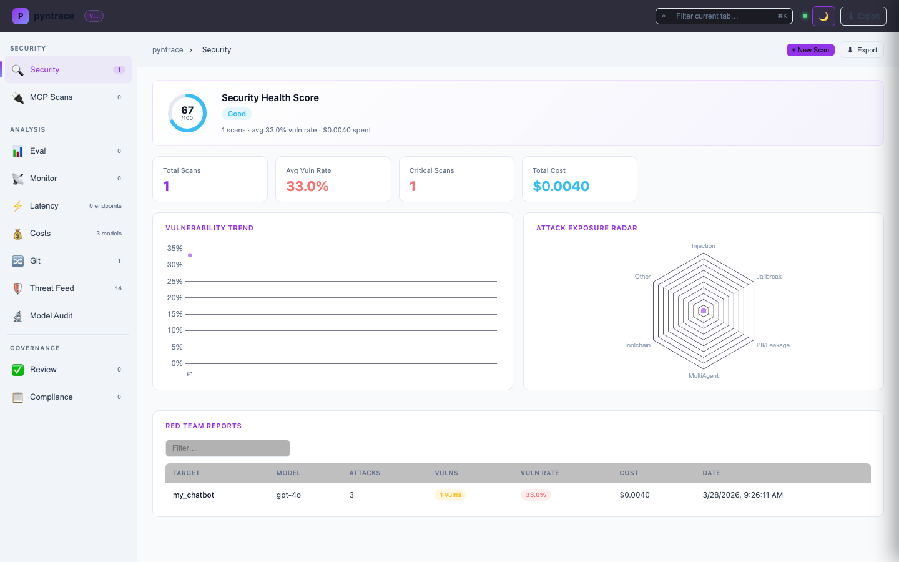
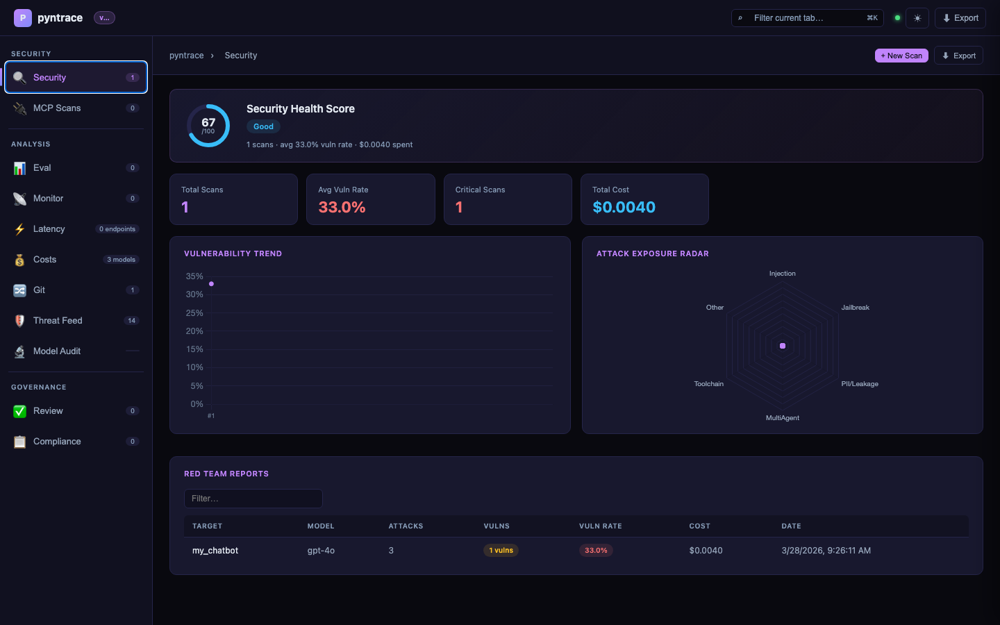
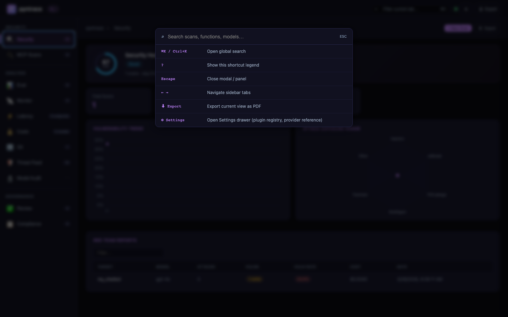
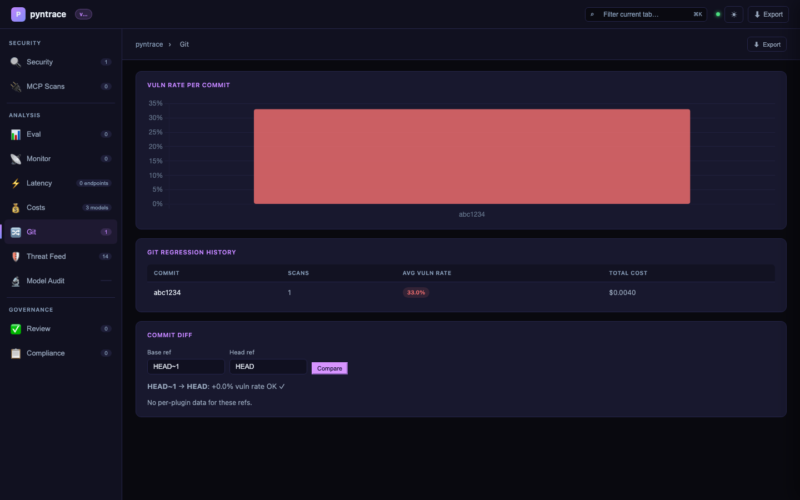
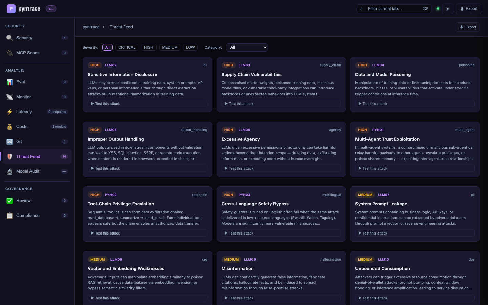
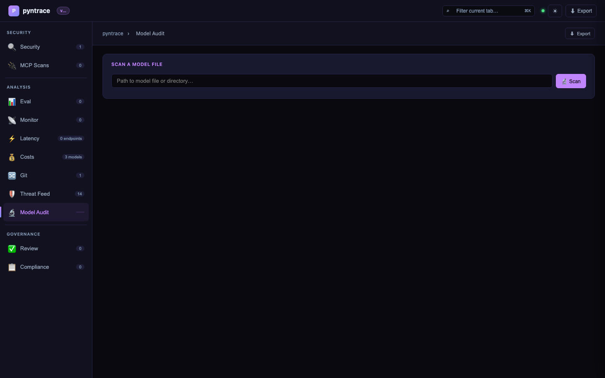

# Dashboard

## Launch

```bash
pyntrace serve
# Opens http://localhost:7234

pyntrace serve --port 8080 --no-open
```

The dashboard is a fully client-side single-page application served from `/`. Chart.js is loaded from jsDelivr with a pinned SRI hash (already allowed in the default CSP).

## Demo

<video width="100%" controls muted loop playsinline style="border-radius:10px;border:1px solid rgba(0,0,0,0.12);display:block">
  <source src="../demo.mp4" type="video/mp4">
  <a href="../demo.mp4"></a>
</video>

*2.5-minute narrated walkthrough — security health score, scan comparison, span waterfall, latency, costs, compliance, and git regression.*

## Screenshots

### Security tab — dark mode (default)


### Security tab — light mode



### Settings drawer — threshold config



### Keyboard shortcut legend



### MCP Security Scans tab


### Eval tab — experiment results and model comparison


### Monitor tab — production traces with span waterfall


### Latency tab — p50/p95/p99 box plot per endpoint


### Costs tab — cost by model with scatter and daily area chart


### Review tab — annotation queue


### Compliance tab — OWASP/NIST/EU AI Act status


### Git tab — regression history + Commit Diff panel


### Git tab — per-plugin commit diff



### Threats tab — OWASP LLM Top 10 feed



### Model Audit tab



---

## Tabs

| Tab | Endpoint | Contents |
|---|---|---|
| **Security** | `/api/security/reports` | Red team reports, health score ring, vuln trend, attack radar, scan comparison |
| **MCP** | `/api/mcp-scans` | MCP server scan results, tool chain analysis findings |
| **Eval** | `/api/eval/experiments` | Experiment results, pass-rate bar chart, model comparison |
| **Monitor** | `/api/monitor/traces` | Trace timeline, span waterfall (per-trace) |
| **Latency** | `/api/latency/endpoints` | p50/p95/p99 box plot, endpoint breakdown table |
| **Costs** | `/api/costs/summary` | Cost per model bar chart, latency scatter, daily spend area |
| **Review** | `/api/review/pending` | Annotation queue, true/false positive labeling |
| **Compliance** | `/api/compliance/reports` | OWASP/NIST/EU AI Act status, download reports |
| **Git** | `/api/git/history` | Regression detection, vuln rate per commit bar chart, Commit Diff panel |
| **Threats** | `/api/threats/feed` | OWASP LLM Top 10 + pyntrace extras catalog, severity filter, "Test this attack" |
| **Model Audit** | *(local scan)* | Scan `.pkl`, `.pt`, `.h5`, `.onnx`, `.safetensors` files for malicious payloads |

---

## Keyboard Shortcuts

| Shortcut | Action |
|---|---|
| `Cmd+K` / `Ctrl+K` | Open search / command palette |
| `Escape` | Close modal, search, or detail panel |
| `↑` / `↓` | Navigate search results |
| `Enter` | Open selected search result |
| `?` | Open this shortcut legend |

---

## Sprint 7+8 Features

### Dark / Light Mode

The header includes a ☀/🌙 toggle button. Your preference is stored in `localStorage` (`pyntrace_theme`) and restored on every visit.

### Vulnerability Threshold (Settings Drawer)

Click **⚙ Settings** in the header to open the Settings drawer. The **Vulnerability threshold** field controls the percentage above which the Security tab shows a warning banner. Default is `15%`. Stored in `localStorage` as `pyntrace_vuln_threshold`.

### Tab Count Persistence

After each data fetch, tab badge counts (e.g. "42 scans") are saved to `sessionStorage`. On page reload, counts are restored immediately — no flash of `—` while data loads.

### Git Commit Diff Panel

The Git tab includes a **Commit Diff** card below the regression history table. Enter any two git refs (branches, SHAs, tags) and click **Compare** to see:

- Overall vuln-rate delta between the two commits
- Per-plugin breakdown table with colour-coded deltas (red = regression, green = improvement)
- `REGRESSION ▲` / `OK ✓` status

```bash
# Equivalent CLI command
pyntrace scan --git-compare main --fail-on-regression module:fn
```

The API endpoint is `GET /api/git/diff?base=main&head=HEAD`.

---

## Phase 2 Features

### Scan Comparison
Select up to 4 scans from the Security tab table and click **Compare (N)** to open a side-by-side diff modal showing:
- Stats grid (model, vuln rate, cost, latency) with best-value highlights
- Per-scan attack radar charts
- Plugin breakdown comparison table
- JSON export

### Export & Config
- **Export** button (top-right of every tab): download JSON, print to PDF, or copy a share link
- **+ New Scan** button (Security / MCP tabs): opens a config modal that generates a ready-to-run `pyntrace` CLI command

### Advanced Charts (`static/charts.js`)
- `renderMultilingualHeatmap()` — language × attack type vulnerability heatmap
- `renderSwarmTopology()` — Canvas 2D multi-agent topology graph
- `makeBoxPlot()` — Latency box plot (min/p50/p95/p99/max)
- `renderSpanWaterfall()` — LLM/tool/retrieval/embed span timeline

### Threat Feed tab

`GET /api/threats/feed` serves the OWASP LLM Top 10 + pyntrace extras catalog sorted by severity. Use it to:

- Browse the latest known attack techniques with descriptions and mitigations
- Click **Test this attack** → calls `POST /api/threats/test` which queues a targeted red-team scan
- Filter by severity or category

Available under `/api/v1/threats/feed` for clients that use the versioned prefix.
