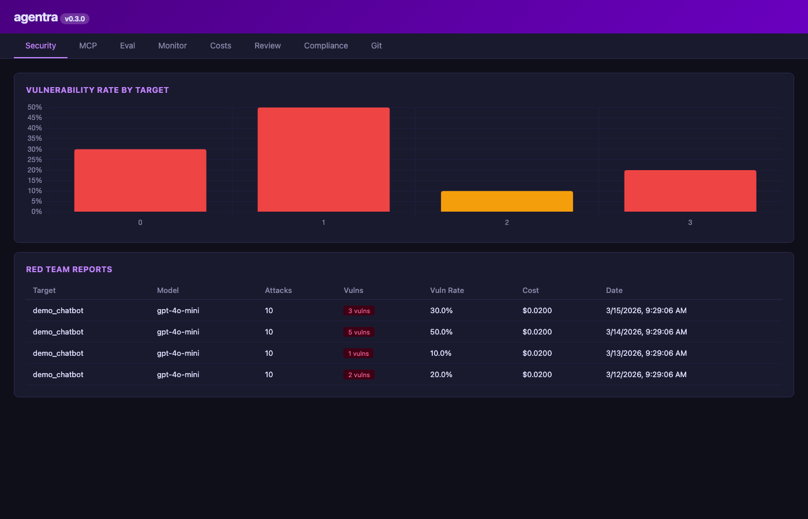
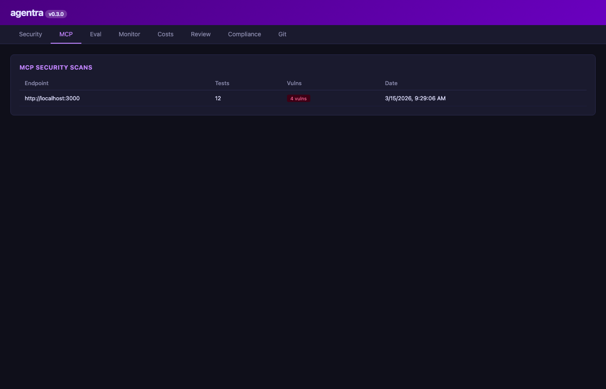
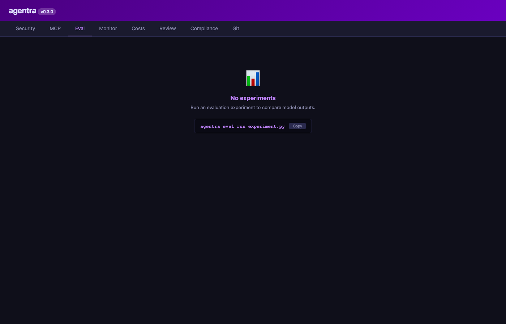
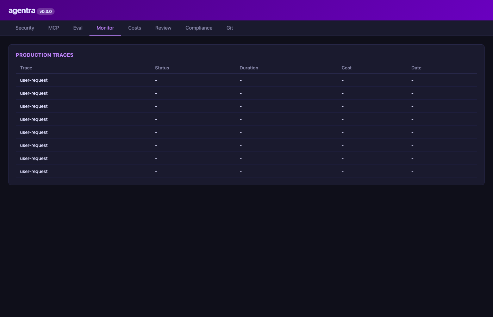
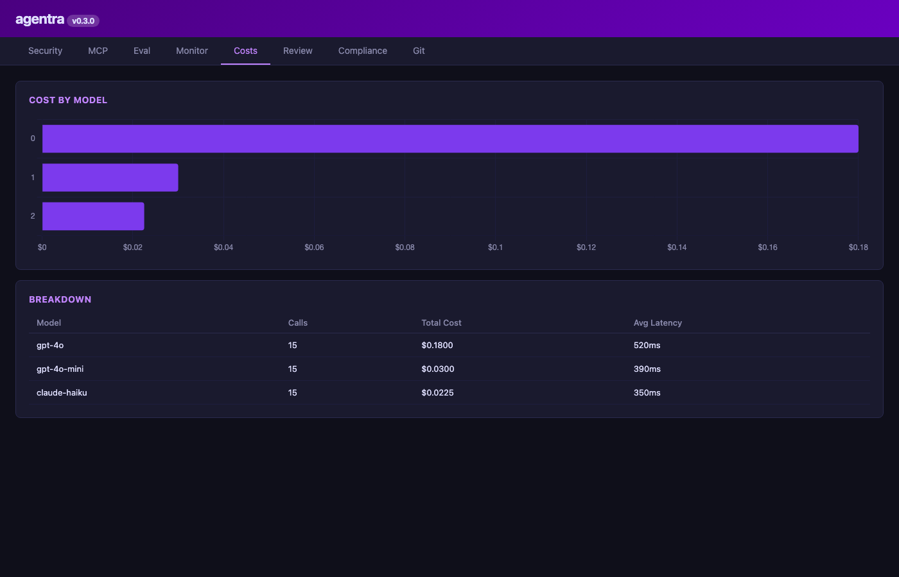
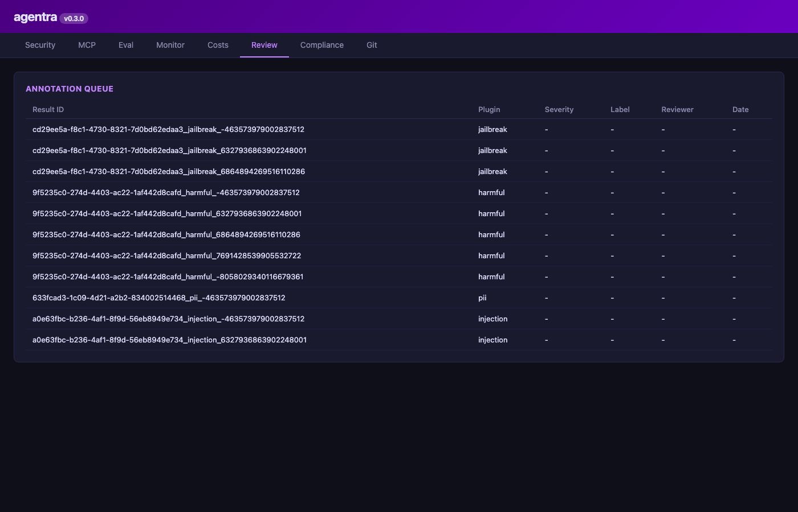
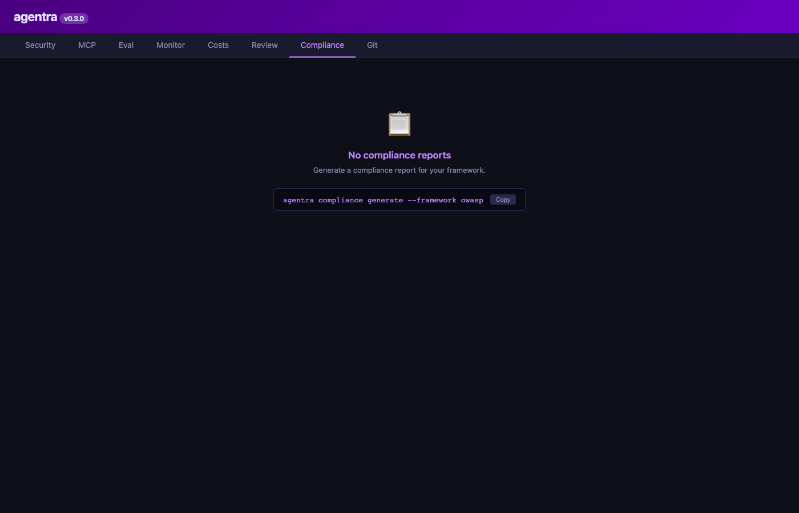
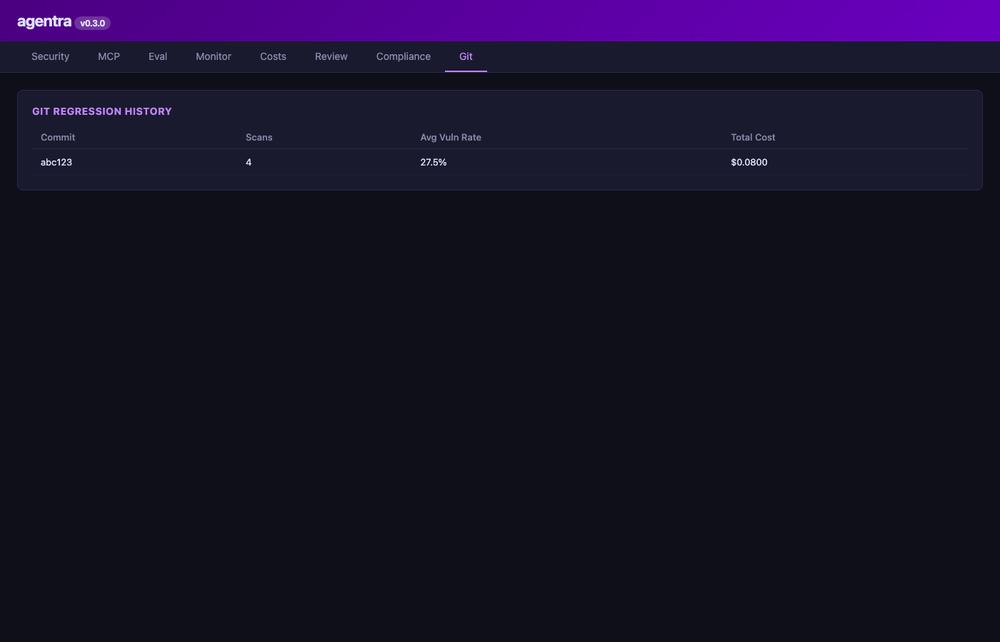

# Dashboard

## Launch

```bash
agentra serve
# Opens http://localhost:7234

agentra serve --port 8080 --no-open
```

## Screenshots

### Security tab — vulnerability rate bar chart and scan history


### Security tab — detailed findings



### MCP Security Scans tab



### Eval tab — experiment results and model comparison



### Monitor tab — production traces



### Costs tab — cost by model breakdown



### Review tab — annotation queue



### Compliance tab — OWASP/NIST/EU AI Act status



### Git tab — scan history across branches



---

## Tabs

| Tab | Contents |
|---|---|
| **Security** | Red team reports, vulnerability trends, fingerprint heatmap |
| **MCP** | MCP server scan results, tool chain analysis findings |
| **Eval** | Experiment results, dataset browser, model comparison |
| **Monitor** | Trace list, span tree, drift status |
| **Costs** | Cost per day, per model, cost per vulnerability |
| **Review** | Annotation queue, true/false positive labeling |
| **Compliance** | OWASP/NIST/EU AI Act status, download reports |
| **Git** | Scan history across git commits and branches |
