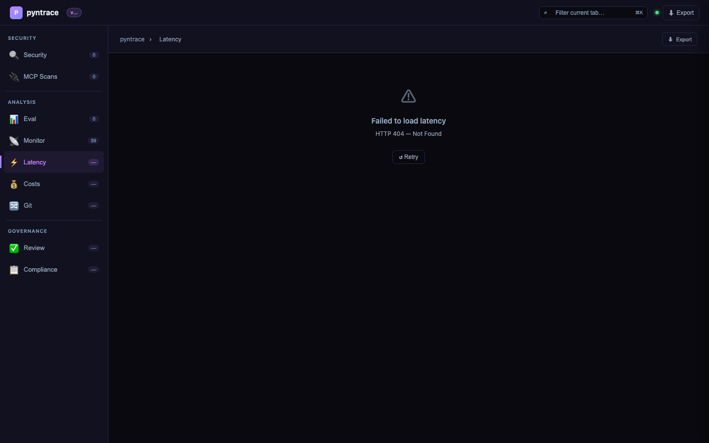

# Dashboard

## Launch

```bash
pyntrace serve
# Opens http://localhost:7234

pyntrace serve --port 8080 --no-open
```

The dashboard is a fully client-side single-page application served from `/`. No JavaScript framework CDN is required — Chart.js is loaded from jsDelivr (already allowed in the default CSP).

## React UI (Phase 3a)

A Vite + React 18 + TypeScript build is also available in `frontend/`. It builds to `pyntrace/server/static/app/` and is served at `/static/app/`.

```bash
# Install and build
make install-ui   # npm install in frontend/
make build-ui     # production build → static/app/

# Development (live reload, proxies /api and /ws to :7234)
make dev-ui       # http://localhost:5173
```

## Screenshots

### Security tab — health score, vulnerability trend, and attack radar


### Security tab — scan comparison modal


### MCP Security Scans tab


### Eval tab — experiment results and model comparison


### Monitor tab — production traces with span waterfall


### Latency tab — p50/p95/p99 box plot per endpoint



### Costs tab — cost by model with scatter and daily area chart


### Review tab — annotation queue


### Compliance tab — OWASP/NIST/EU AI Act status


### Git tab — scan regression history across commits


---

## Tabs

| Tab | Endpoint | Contents |
|---|---|---|
| **Security** | `/api/security/reports` | Red team reports, health score ring, vuln trend, attack radar, scan comparison |
| **MCP** | `/api/mcp-scans` | MCP server scan results, tool chain analysis findings |
| **Eval** | `/api/eval/experiments` | Experiment results, pass-rate bar chart, model comparison |
| **Monitor** | `/api/monitor/traces` | Trace timeline, span waterfall (per-trace) |
| **Latency** | `/api/latency/endpoints` | p50/p95/p99 box plot, endpoint breakdown table |
| **Costs** | `/api/costs/summary` | Cost per model bar chart, latency scatter, daily spend area |
| **Review** | `/api/review/pending` | Annotation queue, true/false positive labeling |
| **Compliance** | `/api/compliance/reports` | OWASP/NIST/EU AI Act status, download reports |
| **Git** | `/api/git/history` | Regression detection, vuln rate per commit bar chart |

## Phase 2 Features

### Scan Comparison
Select up to 4 scans from the Security tab table and click **Compare (N)** to open a side-by-side diff modal showing:
- Stats grid (model, vuln rate, cost, latency) with best-value highlights
- Per-scan attack radar charts
- Plugin breakdown comparison table
- JSON export

### Export & Config
- **Export** button (top-right of every tab): download JSON, print to PDF, or copy a share link
- **+ New Scan** button (Security / MCP tabs): opens a config modal that generates a ready-to-run `pyntrace` CLI command

### Advanced Charts (`static/charts.js`)
- `renderMultilingualHeatmap()` — language × attack type vulnerability heatmap
- `renderSwarmTopology()` — Canvas 2D multi-agent topology graph
- `makeBoxPlot()` — Latency box plot (min/p50/p95/p99/max)
- `renderSpanWaterfall()` — LLM/tool/retrieval/embed span timeline
